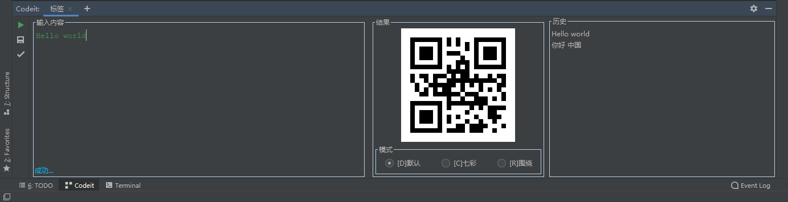
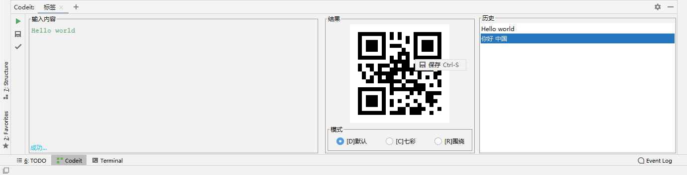

# Codeit

A plug-in generates QR code of a specific text.

Base on [Quoit-idea](https://github.com/shenhuanet/Quoit-idea)

## Preview

## Change Log

[CHANGELOG](CHANGELOG.md)

## Installation
- Using IDE built-in plugin system:
  - <kbd>Preferences</kbd> > <kbd>Plugins</kbd> > <kbd>Browse repositories...</kbd> > <kbd>Search for "Codeit"</kbd> > <kbd>Install Plugin</kbd>
- Manually:
  - Download the [Latest release](https://github.com/jumkey/codeit/releases/latest) and install it manually using <kbd>Preferences</kbd> > <kbd>Plugins</kbd> > <kbd>Install Plugin from disk...</kbd>
  
Restart IDE.

## Todo
1. [x] Add toolWindow multiple tabs
2. [x] I18N
3. [x] Read QR code from the screen
4. [x] 复制图片到剪切板
5. [x] 粘贴图片解析成文本
6. [x] 生成选中的文本
7. [ ] Rename
8. [ ] Refactor history list
9. [ ] UI

## Sponsors

## License

    Copyright 2020 jumkey

    Licensed under the Apache License, Version 2.0 (the "License");
    you may not use this file except in compliance with the License.
    You may obtain a copy of the License at

        http://www.apache.org/licenses/LICENSE-2.0

    Unless required by applicable law or agreed to in writing, software
    distributed under the License is distributed on an "AS IS" BASIS,
    WITHOUT WARRANTIES OR CONDITIONS OF ANY KIND, either express or implied.
    See the License for the specific language governing permissions and
    limitations under the License.
